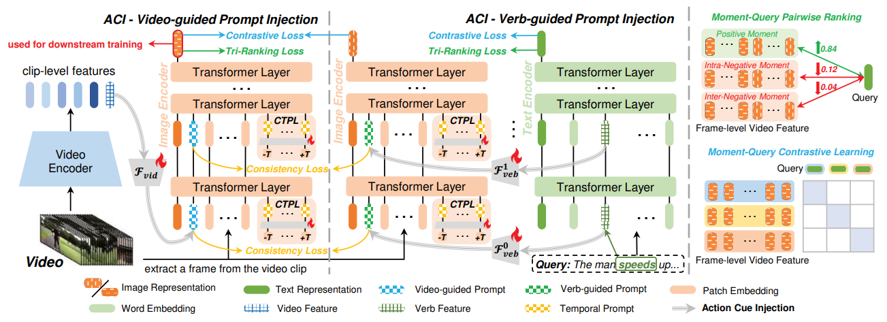

# Actprompt: In-domain feature adaptation via action cues for video temporal grounding

[Yubin Wang](https://scholar.google.com/citations?user=mLeYNLoAAAAJ), [Xinyang Jiang](https://scholar.google.com/citations?user=JiTfWVMAAAAJ), [De Cheng](https://scholar.google.com/citations?user=180lASkAAAAJ),  [Dongsheng Li](https://scholar.google.com/citations?user=VNg5rA8AAAAJ), [Cairong Zhao](https://scholar.google.com/citations?user=z-XzWZcAAAAJ)

[[Arxiv]](https://arxiv.org/pdf/2408.06622)

## Highlights


> **Abstract:** *Video temporal grounding is an emerging topic aiming to identify specific clips within videos. In addition to pre-trained video models, contemporary methods utilize pre-trained vision-language models (VLM) to capture detailed characteristics of diverse scenes and objects from video frames. However, as pre-trained on images, VLM may struggle to distinguish action-sensitive patterns from static objects, making it necessary to adapt them to specific data domains for effective feature representation over temporal grounding. We address two primary challenges to achieve this goal. Specifically, to mitigate high adaptation costs, we propose an efficient preliminary in-domain fine-tuning paradigm for feature adaptation, where downstream-adaptive features are learned through several pretext tasks. Furthermore, to integrate action-sensitive information into VLM, we introduce Action-Cue-Injected Temporal Prompt Learning (ActPrompt), which injects action cues into the image encoder of VLM for better discovering action-sensitive patterns. Extensive experiments demonstrate that ActPrompt is an off-the-shelf training framework that can be effectively applied to various SOTA methods, resulting in notable improvements. The complete code used in this study is provided in the supplementary materials.* 

## Data Preparation

Here we show the tree structure in the data folder under the project (root) path `$root`. You need to create a new folder named `data` and store the video and feature files according to the following structure.

```bash
├──data
│   ├── videos
│   │   ├── TACoS
│   │   ├── QVHighlights
│   │   ├── Charades
│   ├── tacos
│   │   ├── metadata
│   │   │   ├──val.jsonl
│   │   │   ├──test.jsonl
│   │   │   └──train.jsonl
│   │   ├── txt_clip
│   │   ├── vid_clip
│   │   └── vid_slowfast
│   ├── charades
│   │   ├── metadata
│   │   │   ├──charades_test.jsonl
│   │   │   └──charades_train.jsonl
│   │   ├── txt_clip
│   │   ├── vid_clip
│   │   └── vid_slowfast
│   └── qvhighlights
│       ├── metadata
│       │   ├──qvhighlights_test.jsonl
│       │   ├──qvhighlights_train.jsonl
│       │   └──qvhighlights_val.jsonl
│       ├── txt_clip
│       ├── vid_clip
│       └── vid_slowfast
...
```

- Download raw videos for the three datasets and put them under `data/videos/$dataset_name` ([Charades](https://prior.allenai.org/projects/charades)/[QVHighlights](https://nlp.cs.unc.edu/data/jielei/qvh/qvhilights_videos.tar.gz)/[TACoS](https://www.coli.uni-saarland.de/projects/smile/page.php?id=tacos))

- Download metadata files and pre-extracted features of frozen extractors from [here](https://github.com/showlab/UniVTG/blob/main/install.md), and put them under `data/$dataset_name` (charades/qvhighlights/tacos)

## Video Feature Extraction with ActPrompt

- Run our ActPrompt with the following scripts (You should first change `$root` path in these scripts)

```bash
cd extractor
bash ./script/run_cha.sh # for Charades-STA
bash ./script/run_tacos.sh # for TACoS
bash ./script/run_qv.sh # for QVHighlights
```

Notably, when you run the above scripts for the first time, it will take a bit longer (fewer than 10 hours) to segment raw videos and extract `.npy` cache files in `$root/data/$dataset_name/cache` folder for all videos in a specific dataset according to each moment-query pair's video interval automatically. Please ensure you have sufficient space. 

Next, features under `$root/data/$dataset_name/vid_clip` folder will be updated with our ActPrompt for better feature representation, with other feature folders unchanged. 

To accelerate further computation, we convert all feature files within the one feature folder into an HDF5 file, which is stored under `$root/data/$dataset_name/h5py` folder. Therefore, we have three HDF5 files for each dataset: `txt_clip.hdf5`, `vid_clip.hdf5` and `vid_slowfast.hdf5`, which are used for the following training procedure.

## Training and Evaluation

Training a domain-adaptive model will take 1-2 hours every time. As a plug-and-play approach, we have made slight modifications to the code of existing temporal video grounding methods including [Moment-DETR](https://github.com/jayleicn/moment_detr), [QD-DETR](https://github.com/wjun0830/QD-DETR), [UniVTG](https://github.com/showlab/UniVTG), [TR-DETR](https://github.com/mingyao1120/TR-DETR) under `models` folder, enabling them to use our features for training.

- Train and evaluate the model using ActPrompt's features on downstream datasets (you should first change `$root` path in these scripts)

```bash
# e.g. training on Charades-STA based on Moment-DETR
bash ./models/moment_detr/scripts/train_cha.sh

# e.g. evaluating on QVHighlights based on QD-DETR (Only on QVHighlights do you need to test specifically on the test set and run the inference script)
bash ./models/qd_detr/scripts/inference.sh
```

When conducting experiments on QVHighlights, you can find `hl_val_submission.jsonl` and `hl_test_submission.jsonl` in the `$result` directory. You should zip them and submit them on the official platform.

## Feature Files

We provide feature files tuned with our ActPrompt for downstream datasets. You should put them under `data/$dataset_name` (charades/qvhighlights/tacos) and rename the directory to `h5py`.

Charades: [Link](https://pan.baidu.com/s/1AInV3YG8bWfzH6rSybSrAQ?pwd=6cd1)    QVhighlights: [Link](https://pan.baidu.com/s/1ZgZfknxEUsdDEXisov95oA?pwd=sp34)    TACoS: [Link](https://pan.baidu.com/s/1CG9AgmLoPFaXG-FWdUwGmw?pwd=shc2)

## Citation

If you use our work, please consider citing:

```bibtex
@article{wang2024actprompt,
  title={Actprompt: In-domain feature adaptation via action cues for video temporal grounding},
  author={Wang, Yubin and Jiang, Xinyang and Cheng, De and Li, Dongsheng and Zhao, Cairong},
  journal={arXiv preprint arXiv:2408.06622},
  year={2024}
}
```

## Acknowledgments

Our code is based on [HERO_Video_Feature_Extractor](https://github.com/linjieli222/HERO_Video_Feature_Extractor) repository. We thank the authors for releasing their code. If you use our model and code, please consider citing these works as well.
